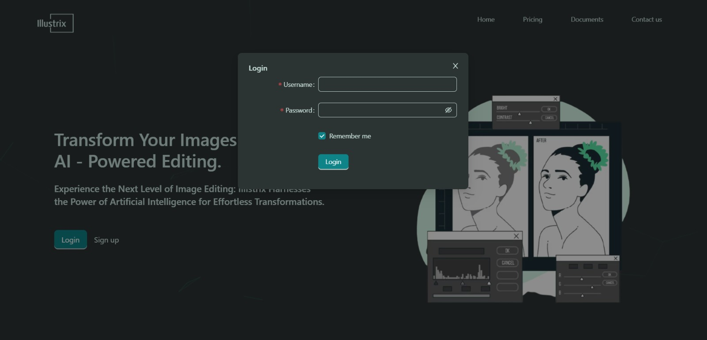
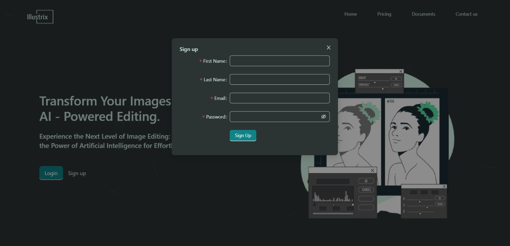

# Illustrix - AI Image Editing

Illustrix is an AI Image editing web application to adjust visuals and transform images into Sketchy, Cartoony, and Impainted.

## Project Description

This project provides an AI picture editing tool that enhances and manipulates images using state-of-the-art algorithms and deep learning techniques. The application offers a wide variety of editing tools, including Background Manipulation, Super-Resolution, Cartoonization, and Image Filters. It aims to provide consumers with an extensive and user-friendly platform for editing their photographs with suitable results. The front-end user interface was created using React, while the system backend is based on a strong architecture. Throughout the development phase, tasks are methodically assigned to particular weeks. The user interface design must be completed, upload functionality must be added, multiple image processing APIs must be integrated, and MongoDB Atlas must be set up for the database.

***

**Project Functionalities:**
The image manipulation tasks included in this project are listed below:
1.	_`Custom Background`_: This task includes several application features, such as removing, blurring, and replacing the background with another image.
2.	_`Image Enhancement`_: In this, the primary task is to convert low-resolution images into super-resolution images with the help of Deep Learning.
3.	_`Image Transformation`_: Here, the aim is to transform the user image into Cartoony, Sketchy or Painted image based on user preference.
4.	_`Image Filters`_: This activity is all about applying some basic filters that we usually see in image editing applications, like Black and White, Contrast, Brightness, Saturation, Sharpening, Hue, Flip Horizontally, and Flip Vertically.

***

## Glimpse of User Interface
The first interaction with user will be using the landing screen as shown below:  

The Login  window for the web application that is displayed to the user:  
 

The Login  window for the web application that is displayed to the user:  

The screen of the application where user gets chance to edit their images is the editing screen as shown in the below image which shows upload image as the initial step and the other image transformation tasks in the left panel:  

